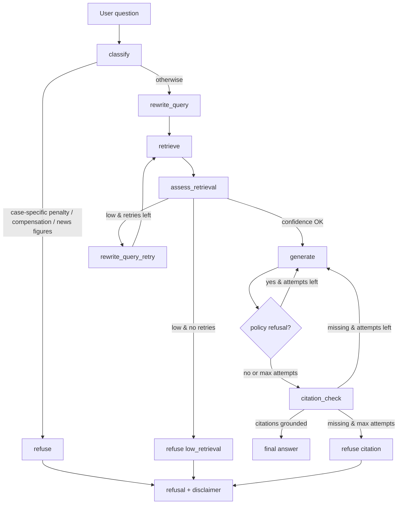

# Fin RAG

CLI-first financial regulation Agentic RAG MVP built on public MOJ and FSC sources.

> Traditional Chinese: [readme-tw.md](readme-tw.md)

## Status

Phase 1 baseline: `eval/baseline-phase1.json` (excerpt corpus, 11 chunks)

Phase 2 baseline: `eval/baseline-phase2b.json` (9 statutes, 20 golden questions, hybrid retrieval, all metrics 1.0)

Phase 3 baseline: `eval/baseline-phase3.json` (20 golden questions, retrieval confidence loop + LLM query rewrite, all metrics 1.0)

Phase 4 baseline: `eval/baseline-phase4.json` (15 statutes, 26 golden questions, all metrics 1.0)

Phase 5 baseline: `eval/baseline-phase5.json` (16 statutes, 34 golden questions, all metrics 1.0)

This repository is at a working MVP stage with **Phase 5 complete** (deepened subsets + insurance act excerpt).

- Public-law corpus ingestion and chunking are in place (**475 chunks, 16 statutes**; `python scripts/spot_check_corpus.py`)
- **Coverage**: AML, securities investment trust/advisory, related-party governance, deepened privacy/securities/bank/trust/FHC/futures excerpts, insurance AML IC, insurance act excerpt. **Most large statutes are curated subsets; not a complete financial law database; not legal advice.**
- Gemini embeddings and generation are wired into the runtime flow
- Retrieval defaults to **hybrid** (BM25 + embedding, RRF fusion); vector search defaults to **FAISS** (`corpus/index.faiss` + `index_meta.jsonl`, preferred when `FIN_RAG_VECTOR_BACKEND=auto`); BM25 lexicon is persisted as `corpus/index_bm25.json` at build time
- Answer flow: `classify → rewrite_query → retrieve → assess_retrieval → generate → citation_check` (low confidence triggers `rewrite_query_retry`; citation failures retry `generate` up to 3 times)
- LangGraph is used when installed, with a sequential fallback for constrained environments
- Golden-set evaluation (**34 questions**) and automated tests pass in CI

Frozen benchmark (`eval/baseline-phase5.json`):

- `citation_hit_rate`: 1.0
- `refusal_accuracy`: 1.0
- `expected_refs_retrieved_rate`: 1.0

Reproduce locally:

```bash
python run_tests.py
FIN_RAG_RETRIEVAL_MODE=hybrid python eval/run.py
```

GitHub Actions runs `python run_tests.py` on push and pull requests (skips Gemini integration tests without an API key).

## Roadmap

- **Phase 1 (done)**: Cited answers, refusal gate, eval harness, CLI + API + Web demo
- **Phase 2 (done)**: Full statute ingest, cross-law expansion, 20 golden questions, hybrid retrieval
  - Phase 2a baseline: `eval/baseline-phase2a.json` (12 questions, 5 full texts)
  - Phase 2b baseline: `eval/baseline-phase2b.json` (20 questions, 9 statutes, track E cross-law)
- **Phase 3a (done)**: Low-score retrieval refusal, `rewrite_query_retry` loop, LLM query rewrite (no hard-coded hints), parallel eval
  - Phase 3 baseline: `eval/baseline-phase3.json` (20 questions, all metrics 1.0)
- **Phase 3c (done)**: Split `generate` / `citation_check` LangGraph nodes; observability fields in API, CLI `--json`, and Web demo
- **Phase 4a/b (done)**: Corpus 9 → 15 statutes, chunks 346 → 409; golden 20 → 26
  - Phase 4 baseline: `eval/baseline-phase4.json`
- **Phase 5 (done)**: Deepened six subsets + insurance act excerpt; chunks 409 → 475; golden 26 → 34
  - Phase 5 baseline: `eval/baseline-phase5.json` (34 questions, all metrics 1.0)
- **Phase 3b (next)**: External write-ups (blog / wiki)

Details: [Phase 2 corpus expansion plan](docs/superpowers/plans/2026-07-03-phase-2-corpus-expansion.md) · Traditional Chinese: [readme-tw.md](readme-tw.md#路線圖)

## What It Does

The project builds a small regulatory corpus from public legal text, splits it into article-level chunks, embeds the chunks with Gemini, retrieves top-k references for a question, and generates a cited answer.

The system is designed to refuse:

- case-specific penalties
- compensation or liability conclusions
- criminal-liability determinations
- unstable news or market-figure claims

This is not legal advice.

## Architecture

Fin RAG is split into three layers: an **offline corpus pipeline**, a **core agent runtime** (`src/fin_rag`), and **thin entrypoints** (CLI, FastAPI, React demo).

```text
┌─────────────────────────────────────────────────────────────────┐
│  Entrypoints                                                    │
│  scripts/ask.py   apps/api (FastAPI)   apps/web (React + Vite)  │
└────────────────────────────┬────────────────────────────────────┘
                             │ question
                             ▼
┌─────────────────────────────────────────────────────────────────┐
│  src/fin_rag                                                    │
│  FinRagAgent  →  classify → rewrite_query → retrieve → assess → generate → citation_check │
│  GeminiClient (embed + generate)   Retriever (hybrid top-k)           │
└────────────────────────────┬────────────────────────────────────┘
                             │ reads
                             ▼
┌─────────────────────────────────────────────────────────────────┐
│  corpus/                                                        │
│  manifest.json → raw/*.html → chunks.jsonl → index.faiss        │
└─────────────────────────────────────────────────────────────────┘
```

### Offline corpus pipeline

Run once (or again after source law updates):

1. **Manifest** — `corpus/manifest.json` lists each public law document (`doc_id`, title, source URL, track, revision date).
2. **Raw sources** — HTML/text under `corpus/raw/` from MOJ / FSC public sites.
3. **Chunking** — `scripts/chunk_by_article.py` parses `第 N 條` boundaries and writes `corpus/chunks.jsonl` (one chunk per article, with `doc_id`, `article`, `text`, `track`).
4. **Indexing** — `scripts/build_index.py` embeds each chunk with Gemini and writes:
   - `corpus/index.jsonl` — embedding cache for incremental rebuilds
   - `corpus/index.faiss` + `corpus/index_meta.jsonl` — FAISS vector index (runtime default when `FIN_RAG_VECTOR_BACKEND=auto`)
   - `corpus/index_bm25.json` — persisted BM25 lexicon (loaded at runtime instead of rebuilding in memory)

```text
manifest.json + raw/*.html
        │
        ▼  chunk_by_article.py
  chunks.jsonl
        │
        ▼  build_index.py  (Gemini embeddings + FAISS + BM25)
   index.jsonl + index.faiss + index_meta.jsonl + index_bm25.json
```

### Online Q&A flow

All user-facing paths call the same `FinRagAgent`:

| Entry | Path | Output |
|-------|------|--------|
| CLI | `scripts/ask.py` | Plain text or `--json` |
| API | `POST /api/ask` via `apps/api` | JSON (`answer`, `citations`, `retrieved`, flags, observability fields) |
| Web demo | `apps/web` → Vite proxy → API | Single-page UI |

**API wiring:** `apps/api/runtime.py` loads `.env`, builds `GeminiClient` + `Retriever`, and returns `FinRagAgent`. Missing API key or index → HTTP 503.

**Web dev:** Vite on port 5173 proxies `/api` to FastAPI on port 8000.

### Agent graph

`FinRagAgent` (`src/fin_rag/agent.py`) runs a fixed pipeline. LangGraph is used when installed; otherwise a sequential fallback runs the same steps.



| Step | Module | Behavior |
|------|--------|----------|
| **classify** | `citations.should_refuse_question` | Rule-based gate for penalty amounts, compensation, criminal liability, unstable figures |
| **rewrite_query** | `agent.FinRagAgent` | LLM rewrites the user question into retrieval queries (corpus catalog aware) |
| **assess_retrieval** | `retrieval_assess` | Max fused RRF score vs `FIN_RAG_MIN_RETRIEVAL_SCORE` |
| **rewrite_query_retry** | `agent.FinRagAgent` | Second-pass LLM rewrite when confidence is low (uses prior queries + weak hits) |
| **retrieve** | `retrieve.Retriever` | Hybrid (BM25 + FAISS/embedding, RRF) or vector-only; top-k from fused ranking |
| **generate** | `gemini.GeminiClient` | System prompt (`prompts/system.md`) + retrieved excerpts → Traditional Chinese answer |
| **citation_check** | `citations.citation_hit` | Parse `doc_id 第 N 條` (including `第 14-2 條`); must match retrieved chunks |
| **refuse** | `agent.FinRagAgent` | Policy / low-retrieval / citation refusal messages |

**Observability fields** (API, CLI `--json`, Web demo): `refusal_reason`, `retrieval_confidence`, `retrieval_round`, `generation_attempts`.

### Evaluation loop

`eval/golden.yaml` holds **34 questions** (tracks A×11, B×11, E×10, C×2). `eval/run.py` runs the agent on each item and writes `eval/last_report.json` with `citation_hit_rate`, `refusal_accuracy`, and `expected_refs_retrieved_rate`. Requires a Gemini API key; CI does not run eval (cost and non-determinism).

## Project Layout

```text
src/fin_rag/         Core package
apps/api/            FastAPI adapter
apps/web/            React demo UI
scripts/             CLI entry scripts
corpus/              Manifest, raw sources, chunks, and index
eval/                Golden set, runner, and last report
tests/               Unit and integration tests
docs/                Design notes and implementation plan
```

## Setup

Requirements:

- Python 3.11+
- Gemini API key

Create `.env` in the project root:

```text
GEMINI_API_KEY=...
FIN_RAG_GENERATION_MODEL=gemini-2.5-flash
FIN_RAG_EMBEDDING_MODEL=gemini-embedding-2
FIN_RAG_RETRIEVAL_MODE=hybrid
FIN_RAG_VECTOR_BACKEND=auto
FIN_RAG_MIN_RETRIEVAL_SCORE=0.028
FIN_RAG_MAX_RETRIEVAL_ROUNDS=1
```

| Variable | Default | Values | Purpose |
|----------|---------|--------|---------|
| `GEMINI_API_KEY` | — | API key | Required for embed, generate, and eval |
| `FIN_RAG_GENERATION_MODEL` | `gemini-2.5-flash` | Gemini model id | Answer generation |
| `FIN_RAG_EMBEDDING_MODEL` | `gemini-embedding-2` | Gemini model id | Query and index embeddings |
| `FIN_RAG_RETRIEVAL_MODE` | `hybrid` | `hybrid`, `embedding` | BM25 + vector RRF, or vector-only |
| `FIN_RAG_VECTOR_BACKEND` | `auto` | `auto`, `faiss`, `jsonl` | Use FAISS index, JSONL scan, or auto-prefer FAISS |
| `FIN_RAG_MIN_RETRIEVAL_SCORE` | `0.028` | float | Max fused RRF score gate; below → retry or refuse |
| `FIN_RAG_MAX_RETRIEVAL_ROUNDS` | `1` | int | Extra rewrite+retrieve rounds when confidence is low |

Install dependencies with your preferred environment manager, then run the commands below from the repo root.

Recommended:

```bash
pip install -e .
```

## Commands

Build chunks from the corpus:

```powershell
python scripts/chunk_by_article.py
```

Build the retrieval index:

```powershell
python scripts/build_index.py
```

Ask a question:

```powershell
python scripts/ask.py "What does CDD require?"
```

Run golden-set evaluation:

```powershell
python eval/run.py
```

Run the full test suite:

```powershell
python run_tests.py
```

## Demo App

Backend:

```bash
uvicorn apps.api.app:app --reload
```

Frontend:

```bash
cd apps/web && npm run dev
```

Vite serves the UI on port 5173 and proxies `/api` to FastAPI on port 8000. Set `GEMINI_API_KEY` in `.env` before submitting questions.

## Corpus Scope

Current MVP tracks:

- Track A: AML, CDD, and internal-control compliance
- Track B: investment-trust related-party and material-event compliance
- Track E: privacy-law excerpt, securities-act director-duty excerpt (cross-law)
- Track C: refusal behavior for penalties, compensation, and unstable claims

Media reports are intentionally excluded from retrieval and cannot be used as legal citations.

See [corpus/README.md](corpus/README.md) for corpus-specific notes.

## Verification

This workspace has already been verified with:

- real `langgraph`
- real `google-genai`
- Gemini generation
- Gemini embeddings

The evaluation runner writes a JSON report to `eval/last_report.json`.

## Safety Notes

Answers must cite retrieved public legal text. If the generated answer does not ground itself in the retrieved references, the agent falls back to refusal instead of returning an unsupported answer.
