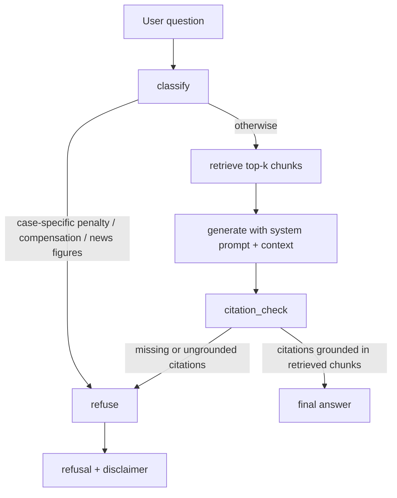

# Fin RAG

CLI-first financial regulation Agentic RAG MVP built on public MOJ and FSC sources.

> Traditional Chinese: [readme-tw.md](readme-tw.md)

## Status

This repository is currently at a working MVP stage.

- Public-law corpus ingestion and chunking are in place.
- Gemini embeddings and generation are wired into the runtime flow.
- Retrieval uses a local JSONL vector index.
- The answer flow runs through `classify -> retrieve -> generate -> citation_check -> final/refusal`.
- LangGraph is used when installed, with a sequential fallback for constrained environments.
- Golden-set evaluation and automated tests are passing.

Latest verified local results:

- `python run_tests.py`: 10/10 tests passed
- `eval/last_report.json`: `citation_hit_rate = 1.0`
- `eval/last_report.json`: `refusal_accuracy = 1.0`
- `eval/last_report.json`: `expected_refs_retrieved_rate = 1.0`

## Roadmap

- **Phase 1 (done)**: Cited answers, refusal gate, eval harness, CLI + API + Web demo
- **Phase 2 (in progress)**: Full statute ingest, cross-track related laws, golden-set expansion
  - Phase 2a baseline: `eval/baseline-phase2a.json` (5 full texts)
  - Batch 1: `aml-act`, `sit-trust-act` (16 golden questions)
- **Phase 3 (after corpus stabilizes)**: Hybrid retrieval (BM25 + embedding), low-score retrieval refusal

Details: [Phase 2 corpus expansion plan](docs/superpowers/plans/2026-07-03-phase-2-corpus-expansion.md) · Traditional Chinese: [readme-tw.md](readme-tw.md#路線圖)

## What It Does

The project builds a small regulatory corpus from public legal text, splits it into article-level chunks, embeds the chunks with Gemini, retrieves top-k references for a question, and generates a cited answer.

The system is designed to refuse:

- case-specific penalties
- compensation or liability conclusions
- criminal-liability determinations
- unstable news or market-figure claims

This is not legal advice.

## Architecture

Fin RAG is split into three layers: an **offline corpus pipeline**, a **core agent runtime** (`src/fin_rag`), and **thin entrypoints** (CLI, FastAPI, React demo).

```text
┌─────────────────────────────────────────────────────────────────┐
│  Entrypoints                                                    │
│  scripts/ask.py   apps/api (FastAPI)   apps/web (React + Vite)  │
└────────────────────────────┬────────────────────────────────────┘
                             │ question
                             ▼
┌─────────────────────────────────────────────────────────────────┐
│  src/fin_rag                                                    │
│  FinRagAgent  →  classify → retrieve → generate → citation_check│
│  GeminiClient (embed + generate)   Retriever (top-k search)     │
└────────────────────────────┬────────────────────────────────────┘
                             │ reads
                             ▼
┌─────────────────────────────────────────────────────────────────┐
│  corpus/                                                        │
│  manifest.json → raw/*.html → chunks.jsonl → index.jsonl        │
└─────────────────────────────────────────────────────────────────┘
```

### Offline corpus pipeline

Run once (or again after source law updates):

1. **Manifest** — `corpus/manifest.json` lists each public law document (`doc_id`, title, source URL, track, revision date).
2. **Raw sources** — HTML/text under `corpus/raw/` from MOJ / FSC public sites.
3. **Chunking** — `scripts/chunk_by_article.py` parses `第 N 條` boundaries and writes `corpus/chunks.jsonl` (one chunk per article, with `doc_id`, `article`, `text`, `track`).
4. **Indexing** — `scripts/build_index.py` embeds each chunk with Gemini and writes `corpus/index.jsonl` (chunk metadata + embedding vector).

```text
manifest.json + raw/*.html
        │
        ▼  chunk_by_article.py
  chunks.jsonl
        │
        ▼  build_index.py  (Gemini embeddings)
   index.jsonl
```

### Online Q&A flow

All user-facing paths call the same `FinRagAgent`:

| Entry | Path | Output |
|-------|------|--------|
| CLI | `scripts/ask.py` | Plain text or `--json` |
| API | `POST /api/ask` via `apps/api` | JSON (`answer`, `citations`, `retrieved`, flags) |
| Web demo | `apps/web` → Vite proxy → API | Single-page UI |

**API wiring:** `apps/api/runtime.py` loads `.env`, builds `GeminiClient` + `Retriever`, and returns `FinRagAgent`. Missing API key or index → HTTP 503.

**Web dev:** Vite on port 5173 proxies `/api` to FastAPI on port 8000.

### Agent graph

`FinRagAgent` (`src/fin_rag/agent.py`) runs a fixed pipeline. LangGraph is used when installed; otherwise a sequential fallback runs the same steps.



| Step | Module | Behavior |
|------|--------|----------|
| **classify** | `citations.should_refuse_question` | Rule-based gate for penalty amounts, compensation, criminal liability, unstable figures |
| **retrieve** | `retrieve.Retriever` | Embed question → cosine search on `index.jsonl` → top-k `RetrievedChunk` |
| **generate** | `gemini.GeminiClient` | System prompt (`prompts/system.md`) + retrieved excerpts → Traditional Chinese answer |
| **citation_check** | `citations.citation_hit` | Parse `(doc 第 N 條)` in answer; must match retrieved metadata or refuse |
| **refuse** | `agent.REFUSAL` | Fixed disclaimer; `refused=true`, `citation_hit=false` |

### Evaluation loop

`eval/golden.yaml` holds 12 questions (tracks A/B/C). `eval/run.py` runs the agent on each item and writes `eval/last_report.json` with `citation_hit_rate`, `refusal_accuracy`, and `expected_refs_retrieved_rate`.

## Project Layout

```text
src/fin_rag/         Core package
apps/api/            FastAPI adapter
apps/web/            React demo UI
scripts/             CLI entry scripts
corpus/              Manifest, raw sources, chunks, and index
eval/                Golden set, runner, and last report
tests/               Unit and integration tests
docs/                Design notes and implementation plan
```

## Setup

Requirements:

- Python 3.11+
- Gemini API key

Create `.env` in the project root:

```text
GEMINI_API_KEY=...
FIN_RAG_GENERATION_MODEL=gemini-2.5-flash
FIN_RAG_EMBEDDING_MODEL=gemini-embedding-2
```

Install dependencies with your preferred environment manager, then run the commands below from the repo root.

Recommended:

```bash
pip install -e .
```

## Commands

Build chunks from the corpus:

```powershell
python scripts/chunk_by_article.py
```

Build the retrieval index:

```powershell
python scripts/build_index.py
```

Ask a question:

```powershell
python scripts/ask.py "What does CDD require?"
```

Run golden-set evaluation:

```powershell
python eval/run.py
```

Run the full test suite:

```powershell
python run_tests.py
```

## Demo App

Backend:

```bash
uvicorn apps.api.app:app --reload
```

Frontend:

```bash
cd apps/web && npm run dev
```

Vite serves the UI on port 5173 and proxies `/api` to FastAPI on port 8000. Set `GEMINI_API_KEY` in `.env` before submitting questions.

## Corpus Scope

Current MVP tracks:

- Track A: AML, CDD, and internal-control compliance
- Track B: investment-trust related-party and material-event compliance
- Track C: refusal behavior for penalties, compensation, and unstable claims

Media reports are intentionally excluded from retrieval and cannot be used as legal citations.

See [corpus/README.md](corpus/README.md) for corpus-specific notes.

## Verification

This workspace has already been verified with:

- real `langgraph`
- real `google-genai`
- Gemini generation
- Gemini embeddings

The evaluation runner writes a JSON report to `eval/last_report.json`.

## Safety Notes

Answers must cite retrieved public legal text. If the generated answer does not ground itself in the retrieved references, the agent falls back to refusal instead of returning an unsupported answer.
