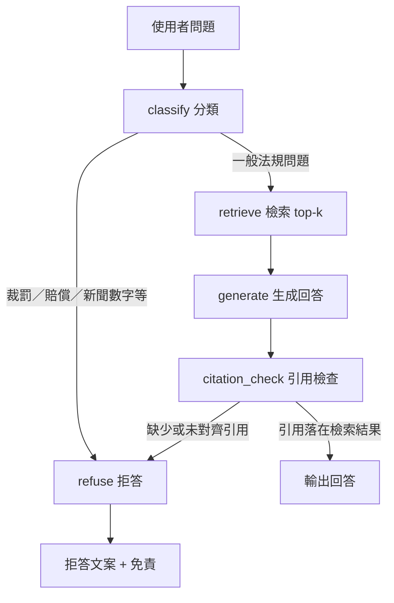

# Fin RAG

以 MOJ／金管會公開法規為 corpus 的金融法規 Agentic RAG MVP（CLI 優先，附 Web demo）。

> English: [README.md](README.md)

## 狀態

Phase 1 baseline: `eval/baseline-phase1.json`（corpus 節錄版，11 chunks）

本 repo 已達可運作的 MVP 階段。

- 公開法規 corpus 入庫與條文 chunk 已完成（目前 346 chunks，見 `python scripts/spot_check_corpus.py`）
- Gemini embedding 與生成已接入執行流程
- 檢索使用本機 JSONL 向量索引
- 問答流程：`classify → retrieve → generate → citation_check → 輸出／拒答`
- 已安裝 LangGraph 時走圖流程；否則使用等價的循序 fallback
- Golden set 評估與自動化測試可通過

最近一次本機驗證結果（請以你執行 `eval/run.py` 的輸出為準）：

- `python run_tests.py`
- `eval/last_report.json`：`citation_hit_rate`、`refusal_accuracy`、`expected_refs_retrieved_rate`

## 路線圖

- **Phase 1（完成）**：可引用、可拒答、可 eval、CLI + API + Web demo
- **Phase 2（進行中）**：完整法條 ingest + 跨增相關法規 + golden 擴充
  - Phase 2a baseline: `eval/baseline-phase2a.json`（5 份全文）
  - Batch 1: `aml-act`、`sit-trust-act`（golden 16 題）
  - Batch 2: `privacy-finance`、`sit-securities-act`（golden 18 題，含 E 軌 cross-law）
- **Phase 3（待 corpus 穩定）**：hybrid retrieval（BM25 + embedding）、檢索低分拒答

詳細計畫：`docs/superpowers/plans/2026-07-03-phase-2-corpus-expansion.md`

## 這個專案做什麼

從政府公開法規文本建立小型法規 corpus，依「條」切 chunk，以 Gemini 向量化，針對問題檢索 top-k 段落，再生成附條號引用的回答。

系統會拒答：

- 特定個案裁罰金額
- 賠償或責任歸屬結論
- 刑事責任判斷
- 不穩定的新聞或市場數字主張

**本系統不構成法律意見。**

## 整體架構

Fin RAG 分三層：**離線 corpus 管線**、**核心 agent 執行期**（`src/fin_rag`）、**薄封裝入口**（CLI、FastAPI、React demo）。

```text
┌─────────────────────────────────────────────────────────────────┐
│  入口                                                           │
│  scripts/ask.py   apps/api (FastAPI)   apps/web (React + Vite)  │
└────────────────────────────┬────────────────────────────────────┘
                             │ 問題
                             ▼
┌─────────────────────────────────────────────────────────────────┐
│  src/fin_rag                                                    │
│  FinRagAgent  →  classify → retrieve → generate → citation_check│
│  GeminiClient（嵌入 + 生成）   Retriever（top-k 檢索）            │
└────────────────────────────┬────────────────────────────────────┘
                             │ 讀取
                             ▼
┌─────────────────────────────────────────────────────────────────┐
│  corpus/                                                        │
│  manifest.json → raw/*.html → chunks.jsonl → index.jsonl         │
└─────────────────────────────────────────────────────────────────┘
```

### 離線 corpus 管線

法規更新或重建索引時執行：

1. **Manifest** — `corpus/manifest.json` 登錄每份法規（`doc_id`、標題、來源 URL、軌別 `track`、修正日期）。
2. **原文** — `corpus/raw/` 存放 MOJ／金管會下載的 HTML 或文字。
3. **切 chunk** — `scripts/chunk_by_article.py` 依「第 N 條」切分，輸出 `corpus/chunks.jsonl`（每條一 chunk，含 `doc_id`、`article`、`text`、`track`）。
4. **建索引** — `scripts/build_index.py` 以 Gemini 嵌入各 chunk，寫入 `corpus/index.jsonl`（metadata + 向量）。

```text
manifest.json + raw/*.html
        │
        ▼  chunk_by_article.py
  chunks.jsonl
        │
        ▼  build_index.py（Gemini embeddings）
   index.jsonl
```

### 線上問答流程

所有入口共用同一個 `FinRagAgent`：

| 入口 | 路徑 | 輸出 |
|------|------|------|
| CLI | `scripts/ask.py` | 純文字或 `--json` |
| API | `POST /api/ask`（`apps/api`） | JSON（`answer`、`citations`、`retrieved`、旗標） |
| Web demo | `apps/web` → Vite proxy → API | 單頁問答介面 |

**API 組裝：** `apps/api/runtime.py` 讀取 `.env`，建立 `GeminiClient` + `Retriever`，回傳 `FinRagAgent`。缺少 API key 或索引檔 → HTTP 503。

**本機開發：** Vite 在 5173 port 將 `/api` 代理至 FastAPI 8000 port。

### Agent 流程圖

`FinRagAgent`（`src/fin_rag/agent.py`）執行固定管線。有 LangGraph 時走圖；否則循序執行相同步驟。



| 步驟 | 模組 | 行為 |
|------|------|------|
| **classify** | `citations.should_refuse_question` | 規則式閘門：裁罰金額、賠償、刑事責任、不穩定數字 |
| **retrieve** | `retrieve.Retriever` | 問題嵌入 → 對 `index.jsonl` 餘弦相似度搜尋 → top-k |
| **generate** | `gemini.GeminiClient` | 系統提示（`prompts/system.md`）+ 檢索片段 → 繁體中文回答 |
| **citation_check** | `citations.citation_hit` | 解析回答中 `(法規名 第 N 條)`，須對應檢索 metadata，否則拒答 |
| **refuse** | `agent.REFUSAL` | 固定拒答與免責；`refused=true` |

### 評估迴圈

`eval/golden.yaml` 含 12 題（軌 A／B／C）。`eval/run.py` 逐題跑 agent，輸出 `eval/last_report.json`（`citation_hit_rate`、`refusal_accuracy`、`expected_refs_retrieved_rate`）。

## 目錄結構

```text
src/fin_rag/         核心套件
apps/api/            FastAPI 適配層
apps/web/            React demo 前端
scripts/             CLI 腳本
corpus/              manifest、原文、chunks、索引
eval/                golden set、runner、最近報告
tests/               單元與整合測試
docs/                設計與實作計畫
```

## 安裝

需求：

- Python 3.11+
- Gemini API key
- （Web demo）Node.js 18+

在專案根目錄建立 `.env`：

```text
GEMINI_API_KEY=...
FIN_RAG_GENERATION_MODEL=gemini-2.5-flash
FIN_RAG_EMBEDDING_MODEL=gemini-embedding-2
```

建議安裝方式：

```bash
pip install -e .
```

## 指令

由 corpus 產生 chunks：

```bash
python scripts/chunk_by_article.py
```

建立檢索索引：

```bash
python scripts/build_index.py
```

單題問答：

```bash
python scripts/ask.py "客戶身分確認 CDD 要做哪些事？"
python scripts/ask.py --json "什麼是風險基礎方法？"
```

跑 golden set 評估：

```bash
python eval/run.py
```

跑完整測試：

```bash
python run_tests.py
```

## Demo 應用

後端（在 repo 根目錄）：

```bash
uvicorn apps.api.app:app --reload
```

前端：

```bash
cd apps/web && npm install && npm run dev
```

瀏覽器開啟 `http://localhost:5173`。提問前請確認 `.env` 已設定 `GEMINI_API_KEY`。

健康檢查：`curl http://127.0.0.1:8000/api/health` → `{"status":"ok"}`

## 測試問題範例

**軌 B（投信利害關係人）**

- 投信董事兼任他公司董事，該公司是否為利害關係人？
- 基金能否買賣利害關係公司發行之證券？

**軌 A（洗錢防制）**

- 什麼是風險基礎方法？
- 客戶身分確認 CDD 要做哪些事？

**軌 C（應拒答）**

- 國泰投信會被金管會罰多少錢？
- 全委帳戶 4.54 億損失由誰賠償？

完整 12 題見 `eval/golden.yaml`。

## Corpus 範圍

MVP 雙軌：

- **軌 A**：洗錢防制、CDD、內控稽核
- **軌 B**：投信利害關係人、重大偶發事件通報
- **軌 C**：裁罰、賠償等拒答行為（eval 專用，不進向量庫）

媒體報導刻意不納入檢索，不得作為法條依據。

詳見 [corpus/README.md](corpus/README.md)。

## 驗證與安全

- 回答須引用檢索到的公開法規文本
- 生成內容若無法對齊引用，agent 改為拒答，避免臆測
- 評估報告寫入 `eval/last_report.json`

本 workspace 曾以真實 `langgraph`、`google-genai`、Gemini 生成與嵌入驗證過；你的環境請自行執行 `run_tests.py` 與 `eval/run.py` 確認。
